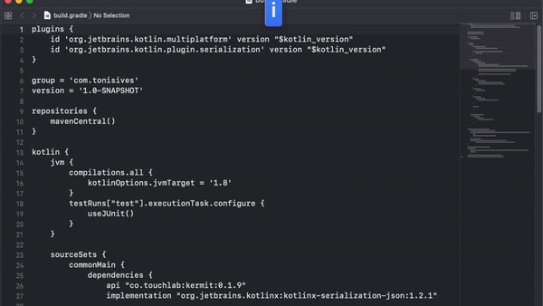
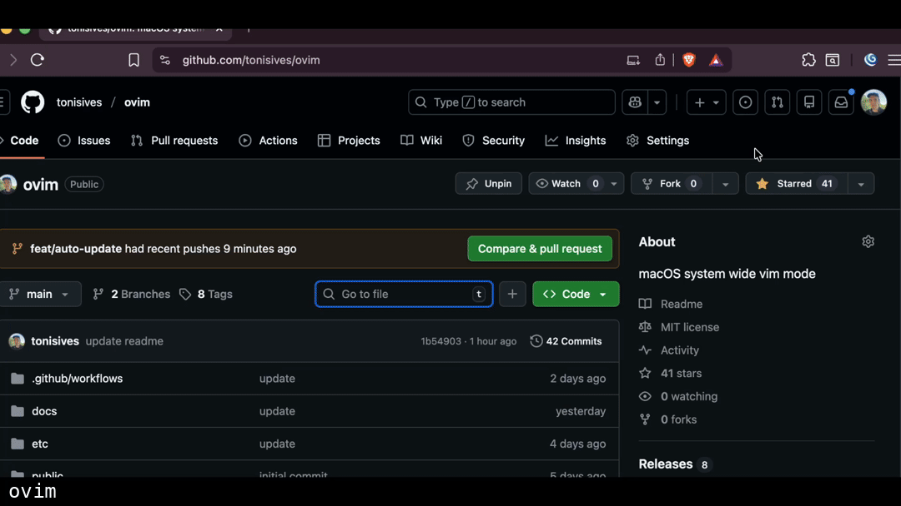
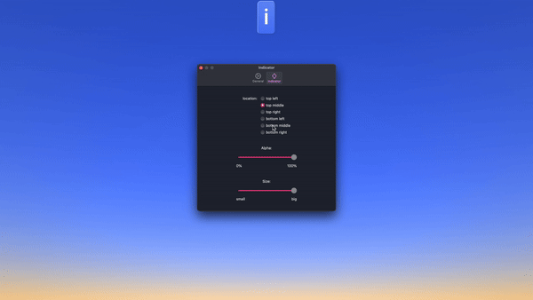

# ovim

macOS system-wide Vim keybindings and modal editor.

**ovim has two independent editing modes:**

| In-Place Mode                                                                                                                                          | Edit Popup                                                                                                                                   |
| ------------------------------------------------------------------------------------------------------------------------------------------------------ | -------------------------------------------------------------------------------------------------------------------------------------------- |
| Simulates Vim motions by intercepting keystrokes and injecting native macOS key events. Works instantly in any app. Supports a subset of Vim commands. | Opens your actual Neovim installation in a terminal window with your full config and plugins. Edit complex text, then paste back with `:wq`. |
|                                      |                                                                                                     |

## Features

| Feature           | In-Place Mode                                                            | Edit Popup                               |
| ----------------- | ------------------------------------------------------------------------ | ---------------------------------------- |
| Vim support       | Basic motions, operators, text objects ([see list](docs/keybindings.md)) | Full Neovim with all your plugins        |
| User config       | In app configuration for widgets, ignore list                            | Uses your `~/.config/nvim`               |
| Speed             | Instant                                                                  | ~500ms (terminal startup)                |
| App compatibility | All apps (with Accessibility permission)                                 | Apps with Accessibility API or browsers  |
| Use case          | Quick edits, modal navigation                                            | Complex edits, regex, macros, multi-line |

## Installation

### Homebrew

```bash
brew install --cask tonisives/tap/ovim
```

### GitHub Releases

Download the latest `.dmg` from the [Releases](https://github.com/tonisives/ovim/releases) page.

### Build from Source

```bash
git clone https://github.com/tonisives/ovim.git
cd ovim
pnpm install
pnpm tauri build
# Built app in src-tauri/target/release/bundle/
```

Requires [Rust](https://rustup.rs/), [Node.js](https://nodejs.org/) v18+, and [pnpm](https://pnpm.io/).

## Requirements

- macOS 10.15 (Catalina) or later
- **Accessibility permission** - Grant in System Settings > Privacy & Security > Accessibility
- Terminal app. `Alacritty` is recommended. We also include Kitty, Terminal.app and WezTerm limited support.

## Quick Start

1. Launch ovim - it appears in your menu bar
2. Grant Accessibility permission when prompted
3. Access Settings from the menu bar icon

| In-Place Mode                                                                                   | Edit Popup                                                                                                     |
| ----------------------------------------------------------------------------------------------- | -------------------------------------------------------------------------------------------------------------- |
| Press **Caps Lock** to toggle between Normal/Insert modes. Use Vim motions directly in any app. | Assign a shortcut to "Toggle Edit Popup" in Settings. Press it to open Neovim, edit, then `:wq` to paste back. |

## In-Place Mode

Toggle between Normal and Insert modes with Caps Lock (configurable). In Normal mode, use Vim motions directly in any application.

**Supported commands:** `hjkl`, `w/b/e`, `0/$`, `gg/G`, `d/y/c` + motions, `dd/yy/cc`, `x`, `p/P`, `u/Ctrl+r`, Visual mode, counts, and more. See [docs/keybindings.md](docs/keybindings.md) for the full list.



### Widgets

Display battery status, time, or selection info

## Edit Popup

Opens your actual Neovim installation in a terminal window. Your full config (`~/.config/nvim`) and all plugins are available.

**How it works:**

1. Assign a shortcut to "Toggle Edit Popup" in Settings
2. Select text in any application (optional - captures existing text)
3. Press your shortcut to open Neovim in a popup terminal
4. Edit with your full Neovim setup (plugins, keybindings, macros, etc.)
5. Type `:wq` to save and paste back, or close the window to cancel

**Supported terminals:** Alacritty, Kitty, WezTerm, iTerm2, Terminal.app

## CLI Tool

ovim includes a CLI for controlling modes from scripts or tools like Karabiner-Elements:

```bash
ovim toggle   # Toggle between insert/normal mode
ovim normal   # Enter normal mode
ovim insert   # Enter insert mode
ovim mode     # Get current mode
```

See [docs/cli.md](docs/cli.md) for full CLI documentation and Karabiner integration examples.


## Issues
Please check logs at `/tmp/ovim-rust.log` and submit an [issue](https://github.com/tonisives/ovim/issues)


## License

MIT License - see [LICENSE](LICENSE) for details.
